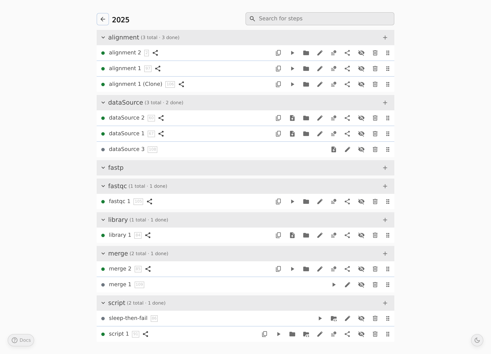

# Pointy Notebook

Pointy Notebook is a web interface for building and running step-based workflows backed by Nix. Users arrange work as projects of steps — file uploads and derivation steps — that connect through a dependency graph; the backend evaluates and builds each step from a Git-pinned user repository.

Pointy is built on top of [`pointy-stdlib`](https://github.com/421anon/pointy-stdlib), which provides the Nix flake library (`pointy-stdlib.lib.mkFlake`) that turns the user repository into the flake outputs Pointy's backend consumes.



## Documentation

User and admin guides live under `docs/`. Build them with `nix build .#docs` and open `./result/index.html`. Highlights:

- [Managing Projects](docs/pages/projects.md), [Building Workflows (Steps)](docs/pages/steps.md), [Execution and Data Management](docs/pages/execution.md) — web UI workflow
- [Architecture & Configuration](docs/pages/admin.md), [Setting Up the User Repository](docs/pages/user-repo-setup.md) — instance administration
- [Type Reference](docs/pages/type-reference.md), [CLI Reference](docs/pages/cli-reference.md) — template options and flake outputs

## Local development VM

A NixOS VM mirrors the production deployment:

```bash
nix run .#dev-vm
```

This starts the VM with the backend and nginx, and forwards:

- `localhost:8080` → VM nginx (frontend + proxy)
- `localhost:2222` → VM SSH

Useful commands inside the VM:

- `systemctl status` — check services
- `journalctl -u backend -f` — follow backend logs
- `less /var/log/nginx/access.log` — nginx access log

Press `C-a x` to shut the VM down. Delete `nixos.qcow2` to reset its persistent state. Restart the VM to pick up backend changes.

To run the frontend dev server against the VM backend, from `frontend/`:

```bash
npm install
npm run dev-vm
```

## Building artifacts

```bash
nix build .#backend   # Haskell backend binary
nix build .#frontend  # compiled static assets
nix build .#docs      # mkdocs site
```

## License

Pointy Notebook is distributed under the GNU Affero General Public License, version 3 or later. See [LICENSE](LICENSE) for the full text.
