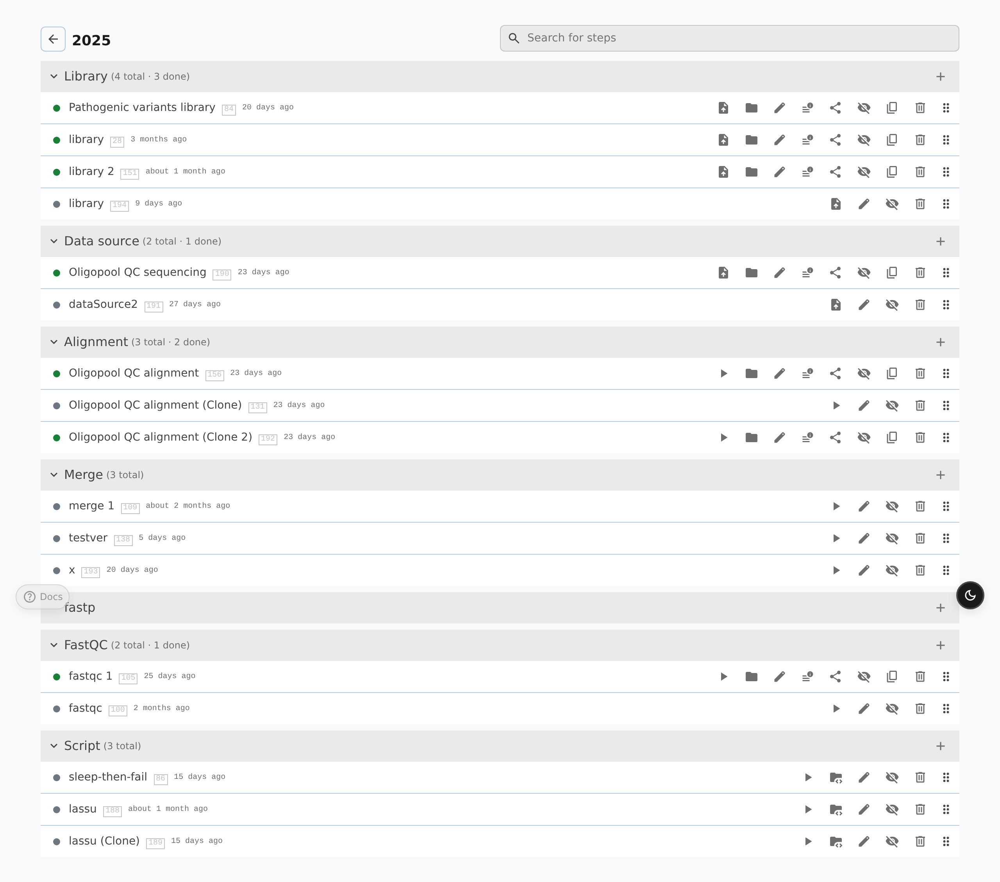

# Pointy Notebook

A notebook for writing, running, organizing and sharing research computation.

[Demo](https://demo.pointy.cloud/)



**For researchers**: Pointy is a web app where you upload experiment design / outcome data, and run analyses on them using any program. The results are pinned to the exact program versions that produced them for maximum traceability even after years. The server side needs to be set up on a Linux computer. Ask your admin.

**For admins**: Pointy is a web app for templating Nix derivations and presenting an auto-generated web UI for users. You write Nix derivation templates, the researchers parametrize and run them, browse and share the outputs, and organize them in projects. The data plane is a pluggable git repository where templates and data co-evolve in a shared history.

## Documentation

User and admin guides live under [docs/](docs/). Build them with `nix build .#docs` and open `./result/index.html`. But it is possible to view them using a markdown reader as well, such as the GitHub web UI.

- [Managing Projects](docs/pages/projects.md), [Building Workflows (Steps)](docs/pages/steps.md), [Execution and Data Management](docs/pages/execution.md) — web UI workflow
- [Architecture & Configuration](docs/pages/admin.md), [Setting Up the User Repository](docs/pages/user-repo-setup.md) — instance administration
- [Type Reference](docs/pages/type-reference.md), [CLI Reference](docs/pages/cli-reference.md) — template options and flake outputs

## Development

A NixOS VM runs a server environment:

```bash
nix run .#dev-vm
```

This starts the VM with the backend and nginx, and forwards:

- `localhost:8080` → VM nginx (backend + docs proxy)
- `localhost:2222` → VM SSH

Useful commands inside the VM:

- `systemctl status` - check services
- `journalctl -u backend -f` - follow backend logs
- `squeue` - list Slurm step build jobs
- `scontrol show job <job-id>` - inspect a Slurm build job
- `journalctl -u slurmctld -u slurmd -f` - follow Slurm controller/worker logs

Press `C-a x` to shut the VM down. Delete `nixos.qcow2` to reset its persistent state. Restart the VM to pick up backend changes.

To run the frontend dev server against the VM backend, from `frontend/`:

```bash
nix develop .#frontend -c npm run dev-vm
```

## Building artifacts

```bash
nix build .#backend        # Haskell backend binary
nix build .#frontend       # compiled static assets
nix build .#docs           # mkdocs site
nix run .#take-screenshots # take screenshots for the mkdocs site
```

## Documentation screenshot generators

Screenshot generators live in [`screenshots/`](screenshots/) and are run by `screenshots/run-all-screenshots.js`. The compare-file docs use:

- `screenshots/output-file-compare-selection.js` for the first-file selection banner
- `screenshots/output-file-compare-dialog.js` for the completed comparison dialog

Use `nix run .#take-screenshots` when you intentionally want to refresh the checked-in documentation images. The app runs inside the screenshots VM, writes light and dark images under `docs/pages/screenshots/`, and reads its fixture repository from `POINTY_USER_REPO` (default: `../pointy-welker`). Set `SCREENSHOTS_OUT` to write to a different output directory.

When adding a generator, create a `screenshots/<name>.js` file that exports `capture(session)`, add it to the ordered `screenshotScripts` list in `screenshots/run-all-screenshots.js`, and reference the light image from Markdown as `screenshots/light/<name>.png`. The docs theme script swaps that path to the matching dark image automatically.

## License

Pointy Notebook is distributed under the GNU Affero General Public License, version 3 or later. See [LICENSE](LICENSE) for the full text.
