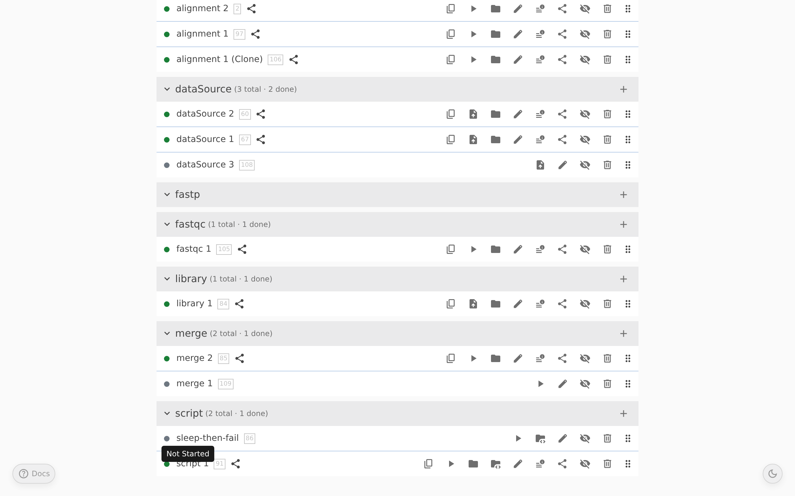
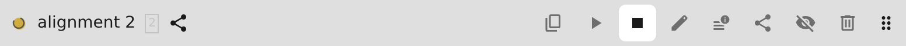
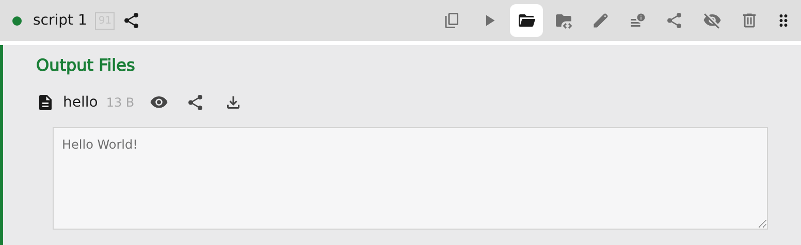
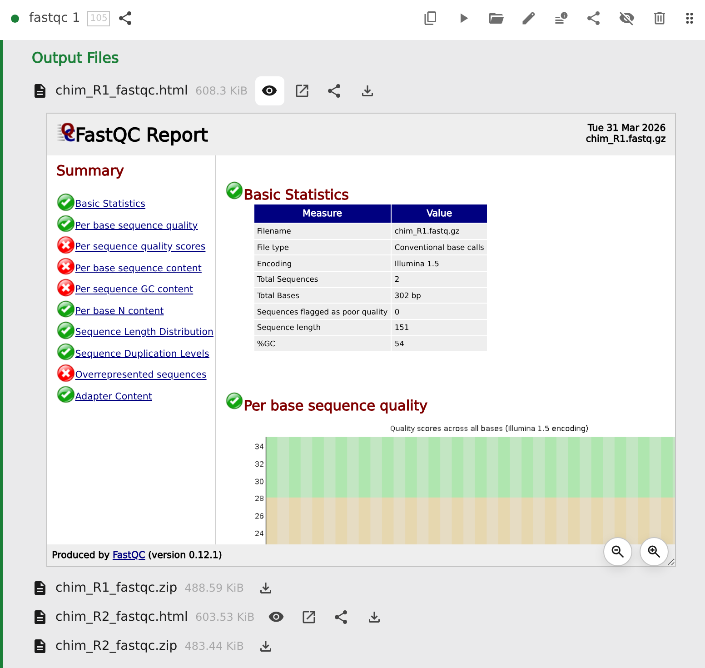
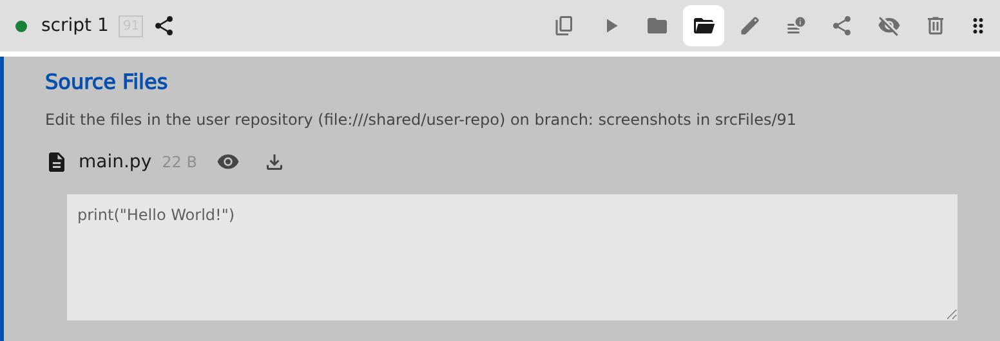
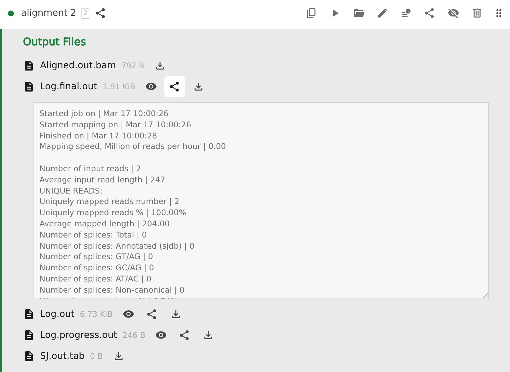

# Execution and Data Management

This page covers running steps, uploading files, browsing results, using source files, and creating share links.

## Running derivation steps

Derivation steps show a **Run** button. Clicking it asks the backend to build that step and whatever upstream dependencies it needs.

Pointy runs builds from a Git-pinned version of the user repository, so a build corresponds to a specific committed workflow state.

## Step statuses

Each step row shows a small status dot. Pointy reports six statuses:

-  **Not Started** — the step exists but has not produced a successful output yet
-  **Running** — the backend is currently building the step
-  **Success** — the build finished successfully and output files are available
-  **Failure** — the build failed; hover the dot to see the last meaningful line from the build log when available
-  **Loading** (unknown) — the status is not yet known; a spinner is shown with no dot behind it
-  **Loading Running** — the step was just started and Pointy is waiting for the backend to confirm it is running; the yellow Running dot is shown behind the spinner

Status changes are pushed to the browser automatically, so you do not need to refresh the page while waiting for a build.

## Shareable states

- **Running** steps are shareable.
- **Successful** steps are shareable.
- **Failed** steps are not marked shareable.

In Pointy, shareable means the UI can expose inspect, clone, and share actions for that step state. Successful steps also expose share actions on output entries. See [Building Workflows (Steps)](steps.md) for step-editing workflows.

## Stopping a running step

While a step is running, a **Stop** button appears in the same control area as **Run**. Stopping the step cancels the active build so you can adjust the step and run it again.

## Uploading files

File upload steps use **Upload files** instead of **Run**.

Templates decide which file extensions are accepted. You can upload one or more files, watch transfer progress in the UI, and cancel an in-progress upload if needed.

After the upload finishes, Pointy immediately builds the file-upload step, so it then moves through the same Running / Success / Failure lifecycle as other steps.

## Browsing output files

Successful steps can open an **Output Files** browser.

From there you can:

- expand folders
- preview supported files inline
- download files
- share the whole output, a folder, or a specific file

HTML outputs support both:

- inline preview
- **Open in new tab** for a normal browser view

Inline HTML preview also exposes **Zoom In** and **Zoom Out** controls.

## Source files

Some derivation step types enable **Source Files**. For those step types, Pointy shows a Source Files section in the step view even when the directory is still empty.

That section lets users:

- browse and download any existing source files
- see which `srcFiles/<step-id>/` directory belongs to the step
- see which user-repository URL and branch those files come from

Source files are configured by instance admins. See [Setting Up the User Repository](user-repo-setup.md#injecting-srcfiles-into-a-build) if you need to enable this for a template.

## Share links and read-only views

Shareable steps and shareable output entries expose a **Share** action.

A share link:

- opens the project in a **read-only** view
- pins the page to a specific Git commit
- can deep-link to the step itself or to a specific output file or folder inside it

This is what makes share links stable: the recipient sees the version of the workflow state that the link was created for, not whatever happens to be current later on.

The read-only banner includes a **View current version** link when you want to leave the pinned view and go back to the live project.

