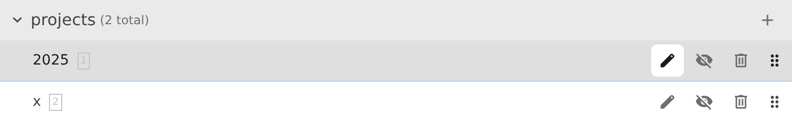
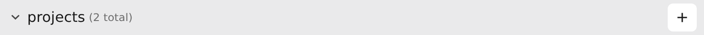
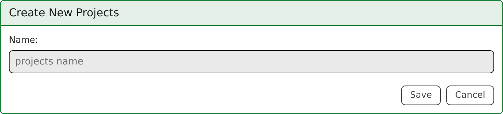

# Managing Projects

Projects are the top-level containers in Pointy. The home page lists them and lets you open, create, reorder, hide, and delete them.

If you want to work inside a project after opening it, continue with [Building Workflows (Steps)](steps.md).

## Opening, creating, and renaming projects

Click a project row to open it.

To create a project, use the **+** button in the Projects table header.

You can rename an existing project from the edit form, or by using the inline pencil icon next to the project name.

## Hiding and showing projects

Hiding a project removes it from the default home-page list without deleting it. This is useful when you want to keep old work around but reduce visual clutter.

Use:

- **Hide** on a project row to hide a single project
- **Show Hidden** in the table header to include hidden projects in the list
- **Unhide All** in the table header to make every hidden project visible again

## Reordering projects

You can reorder projects with the drag handle shown on each row. The order is saved, so the home page keeps the same project ordering on reload.

## Deleting projects

Deleting a project removes the project itself from the UI and deletes its `projects/<id>.nix` definition from the user repository.

## Jumping directly to a step

The header search box is a **global step search**. It does not search project names. Instead, it lets you jump straight to a step from anywhere in the UI.

Selecting a result opens the corresponding project and highlights the chosen step.

For step-level organization inside a project, see [Building Workflows (Steps)](steps.md). For running steps and browsing outputs, see [Execution and Data Management](execution.md).
