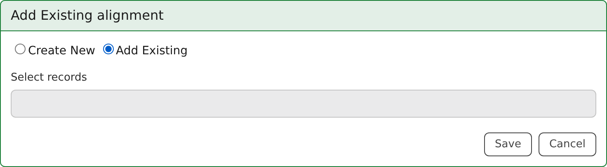
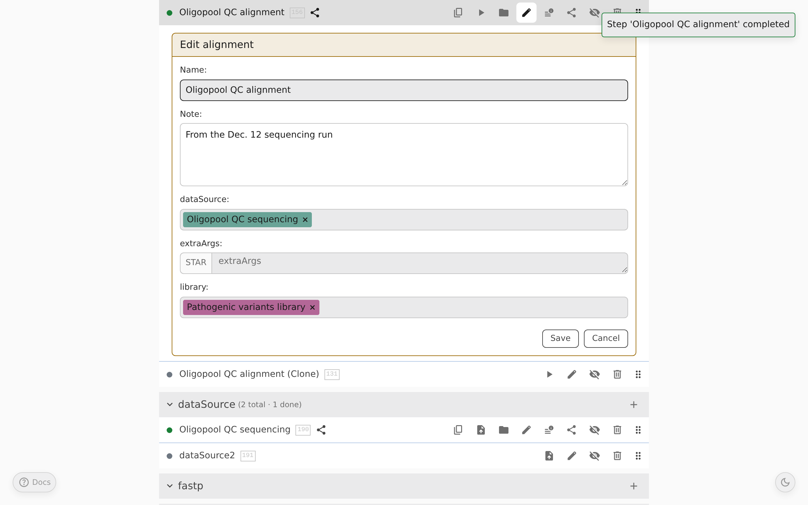
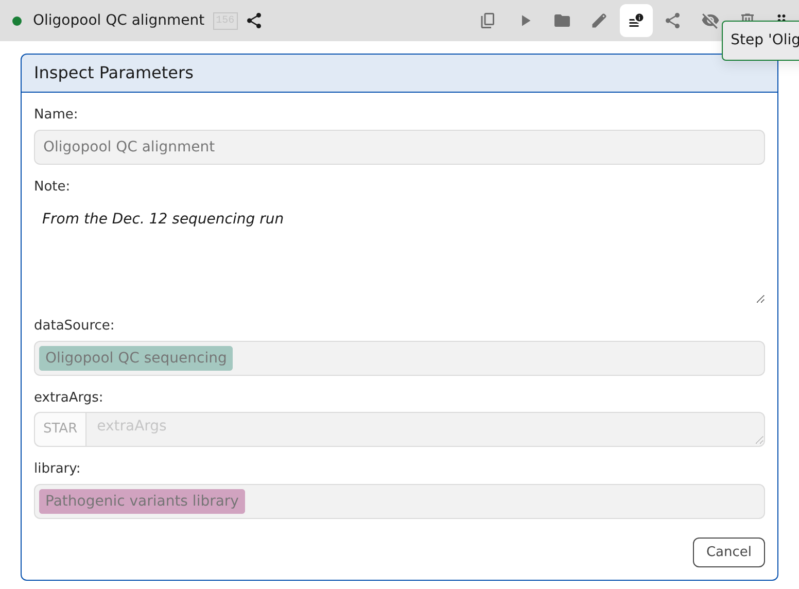
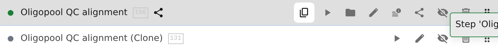

# Building Workflows (Steps)

Inside a project, Pointy organizes work as **steps**. Each table in the project view represents one step type, and each row is one step instance.

Step types are defined by the instance's templates. If you administer the instance, see [Setting Up the User Repository](user-repo-setup.md) and the [Type Reference](type-reference.md).

## Step types

### File upload steps

File upload steps are for files that users provide directly through the UI. The exact allowed file extensions depend on the template for that step type.

Examples from the sample repository include library CSV uploads and sequencing-read uploads.

### Derivation steps

Derivation steps are runnable build steps. Their forms can contain:

- plain text fields
- command-style argument fields
- multi-line text areas
- references to other steps
- repeatable lists of strings or step references

Step references resolve to the selected upstream step's output during the build.

## Creating steps

Use the **+** button in a step table header to add a step of that type.

When adding a step, you can choose between:

- **Create New** — create a brand-new step definition
- **Add Existing** — assign an already-existing step to the current project

## Configuring step arguments

When you create or edit a derivation step, Pointy renders a form from the step type definition.

Depending on the template, you may need to:

- fill in text or command arguments
- write longer script bodies
- choose upstream steps from dropdowns
- add multiple values to list fields

Step-reference selectors choose from steps that are already assigned to the **current project**. If you want to reference a step that currently lives in another project, first add that step to the current project with **Add Existing**.

## Editing, inspecting, and cloning

All steps can be edited. The **Edit** button opens the same form shown in [Configuring step arguments](#configuring-step-arguments).

Once a step is shareable, share links point to the revision they were generated at. Further editing creates a new revision.

To see the parameters in read-only mode, use the **Inspect Parameters** button.

If you want to branch from a shareable step instead of changing it in place, use **Clone** to create a new editable copy with the same configuration.

### Change highlighting while editing

When you edit a step, Pointy highlights any field with a yellow border whose value currently differs from the saved step definition. This is a live editing aid: it shows what you have changed in the current form before you click **Save**.

### Notes on steps

Each step has a free-form **Note** field for your own commentary — explanations, caveats, links, anything that helps you or a collaborator make sense of the step later. Notes live on the step definition, so they travel with the step across every project it is assigned to.

## Reusing a step across projects

A single step can be assigned to multiple projects.

This is important:

- the **step definition** is shared across those projects
- the **execution state and outputs** are shared too
- **visibility** and **sort order** are stored per project

So adding an existing step to another project means linking to the same step rather than copying it.

Removing a step from the current project only unassigns it from that project.

## Organizing steps inside a project

### Reordering

You can reorder steps within each step-type table via drag and drop. The saved order is kept across reloads.

### Hiding

You can hide a step without deleting it. Hidden state is also stored per project, so a step can be hidden in one project and visible in another.

### Search

The page-header search box is a global step search. Selecting a result jumps to that step, even if it belongs to another project. It does not filter the currently displayed table.

For running steps, uploading files, browsing outputs, and share links, continue with [Execution and Data Management](execution.md).
