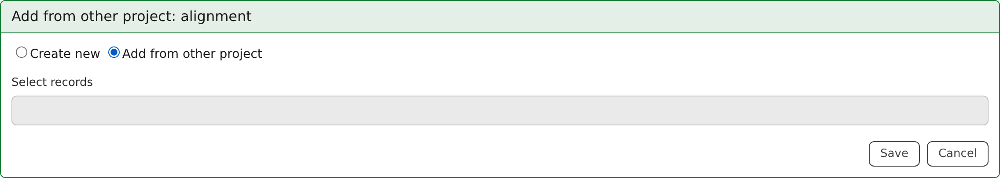
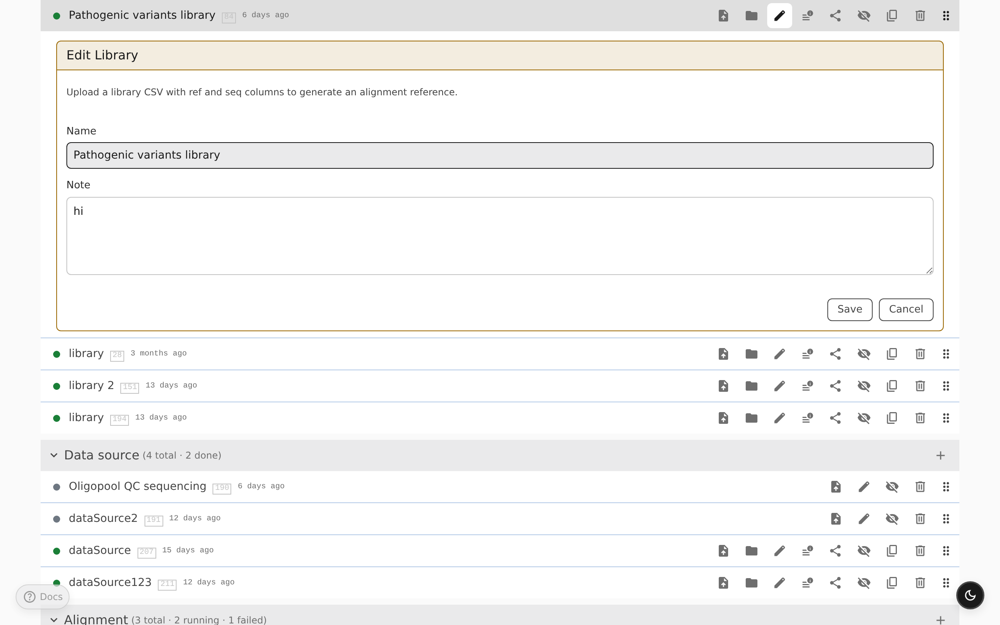
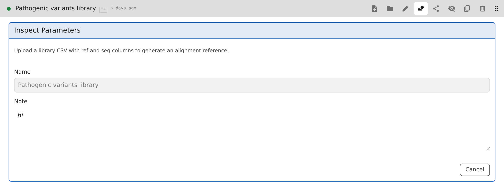

# Building Workflows (Steps)

Inside a project, Pointy organizes work as **steps**. Each table in the project view represents one step type, and each row is one step instance.

Step types are defined by the current project's active templates. Projects can use an admin-defined preset bundle or a custom template list; see [Managing Projects](projects.md#choosing-project-templates). If you administer the instance, see [Setting Up the User Repository](user-repo-setup.md), the [Type Reference](type-reference.md), and the preset notes in [Project presets](user-repo-setup.md#project-presets).

## Step types

### File upload steps

File upload steps are for files that users provide directly through the UI. The exact allowed file extensions depend on the template for that step type.

Examples from the sample repository include library CSV uploads and sequencing-read uploads.

### Derivation steps

Derivation steps are runnable build steps. Their forms can contain:

- plain text fields
- command-style argument fields
- multi-line text areas
- syntax-highlighted code editors
- enum dropdowns
- references to other steps
- repeatable lists of strings, step references, or structured records
- autocomplete-backed string lists inside structured records, for values such as package names
Step references resolve to the selected upstream step's output during the build.

## Creating steps

Use the **+** button in a step table header to add a step of that type.

When adding a step, you can choose between:

- **Create new** — create a brand-new step definition
- **Add from other project** — assign an already-existing step to the current project

## Configuring step arguments

When you create or edit a derivation step, Pointy renders a form from the step type definition.

Depending on the template, you may need to:

- fill in text, command, or code arguments
- choose enum values from dropdowns
- choose upstream steps from selectors
- add multiple values to list fields
- add rows to structured record lists when a template groups several related fields together; record fields can include autocomplete-backed string lists whose suggestions update as you type while still allowing free-text values

Step-reference selectors choose from steps that are already assigned to the **current project**. If you want to reference a step that currently lives in another project, first add that step to the current project with **Add from other project**. Existing saved references that no longer belong to the project are kept visible with a **not in project** label so you can fix them deliberately.

## Editing, inspecting, and cloning

All steps can be edited. The **Edit** button opens the same form shown in [Configuring step arguments](#configuring-step-arguments).

Once a step is shareable, share links point to the revision they were generated at. Further editing creates a new revision. Step rows show a relative **last modified** timestamp when Pointy can read the corresponding `steps/<id>.nix` Git history; hover it for the exact timestamp.

To see the parameters in read-only mode, use the **Inspect Parameters** button.

If you want to branch from a shareable step instead of changing it in place, use **Clone** to create a new editable copy with the same configuration. The Clone action sits next to the row's remove/delete action so copying and removing a step are available in the same action cluster.

### Change highlighting while editing

When you edit a step, Pointy highlights any field with a yellow border whose value currently differs from the saved step definition. This is a live editing aid: it shows what you have changed in the current form before you click **Save**.

### Notes on steps

Each step has a free-form **Note** field for your own commentary — explanations, caveats, links, anything that helps you or a collaborator make sense of the step later. Notes live on the step definition, so they travel with the step across every project it is assigned to.

## Reusing a step across projects

A single step can be assigned to multiple projects.

This is important:

- the **step definition** is shared across those projects
- the **execution state and outputs** are shared too
- **visibility** and **sort order** are stored per project

So adding an existing step to another project means linking to the same step rather than copying it.

Removing a step from the current project only unassigns it from that project.

## Inactive-template warnings

When a project's active preset or custom template list no longer includes a template used by an assigned step, Pointy does not discard that step. The project view shows a collapsible warning listing those orphaned steps by id, type, and name. Re-enable the template, unassign the step from the project, or leave the warning collapsed if the project intentionally no longer uses that template.

## Organizing steps inside a project

### Reordering

You can reorder steps within each step-type table via drag and drop. The saved order is kept across reloads.

### Hiding

You can hide a step without deleting it. Hidden state is also stored per project, so a step can be hidden in one project and visible in another.

### Search

The page-header search box is a global step search. Selecting a result jumps to that step, even if it belongs to another project. It does not filter the currently displayed table.

For running steps, uploading files, browsing outputs, and share links, continue with [Execution and Data Management](execution.md).
